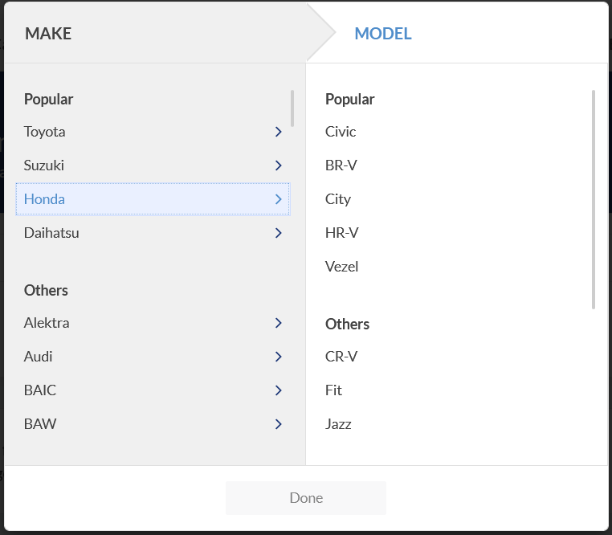
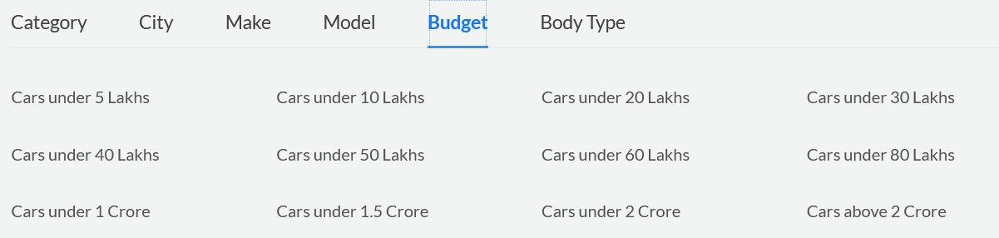
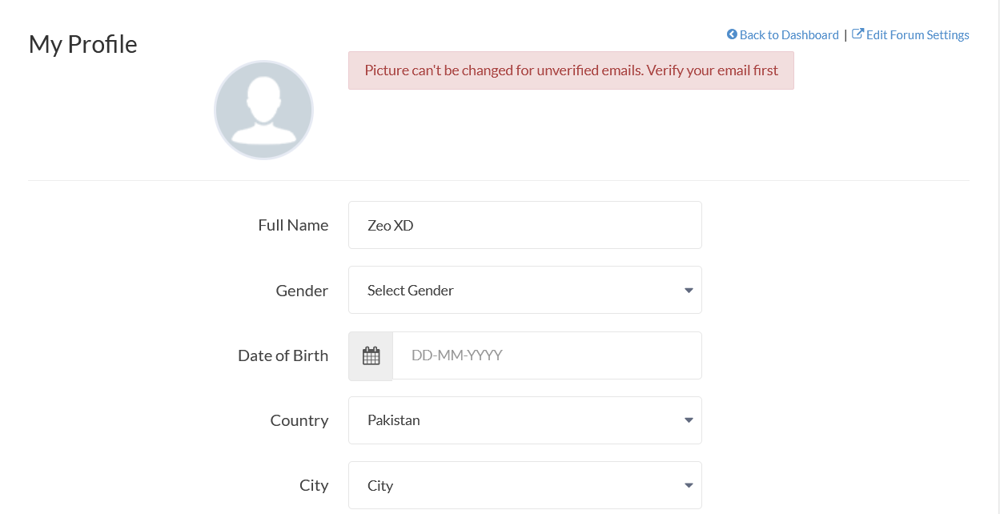
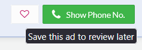
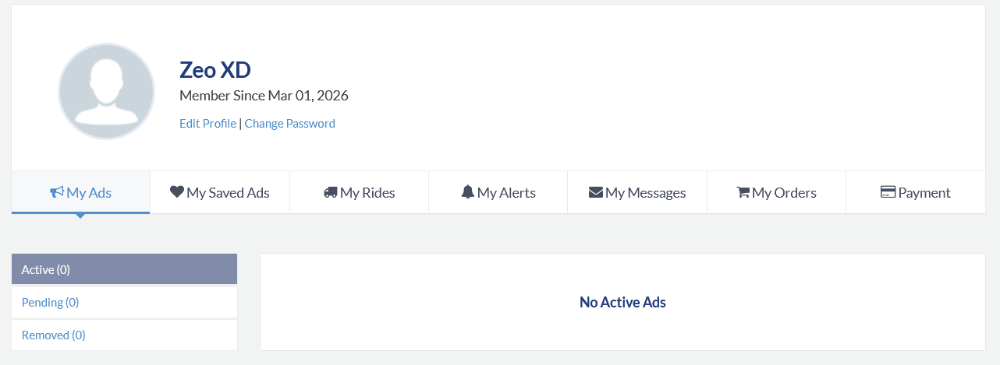
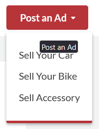
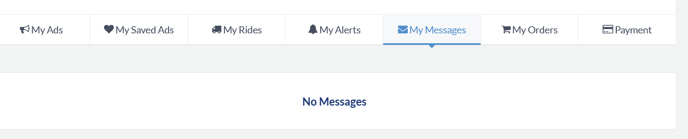

# Car Store Management System

**Name:** Taher Mustansir \
**Roll:** 25K-0119 \
**Section:** BAI-2C \

---

# References

## 1. Login

### Menu - Menu.cpp

```cpp
void Menu::handleLogin() {
    string username;
    string password;

    cout << "Login" << "\n";
    cout << "Username: ";
    getline(cin, username);
    cout << "Password: ";
    getline(cin, password);

    currentUser = app->loginUser(username, password);
    if (currentUser) {
        cout << "Logged in as " << currentUser->getRole() << "\n";
    }
}
```

### Authentication - App.cpp

```cpp
User* App::loginUser(const string& username, const string& password) const {
    User* user = findUserByUsername(username);
    if (user && user->authenticate(password)) {
        cout << "Login successful" << "\n";
        return user;
    }
    cout << "Invalid username or password\n";
    return nullptr;
}
```

### User Searching - App.cpp

```cpp
User* App::findUserByUsername(const string& username) const {
    if (username.empty()) return nullptr;
    for (int i = 0; i < userCount; i++) {
        if (users[i] && users[i]->getUsername() == username) {
            return users[i];
        }
    }
    return nullptr;
}
```

### Password Verification - User.cpp

```cpp
bool User::authenticate(const string& pass) const {
    return password == pass;
}
```

### Screenshot


### Reasoning

The login flow divided into UI handling (Menu::handleLogin) and logic (App::loginUser). Searching a user does a linear search through the users array. Password checking uses direct string comparison. Using string is better than C style char*.

---

## 2. View Listings

### Menu Trigger - Menu.cpp

```cpp
if (choice == 1) {
    app->getMarketplace().displayAllListings();
    pause();
}
```

### Display All Approved Listings - Marketplace.cpp

```cpp
void Marketplace::displayAllListings() const {
    cout << "Approved Listings\n";
    int approvedCount = 0;
    for (int i = 0; i < listingCount; i++) {
        if (listings[i] && listings[i]->getIsApproved()) {
            listings[i]->display();
            approvedCount++;
        }
    }
    if (approvedCount == 0) {
        cout << "No approved listings\n";
    } else {
        cout << "Total approved listings: " << approvedCount << "\n";
    }
}
```

### Individual Listing Display - Listing.cpp

```cpp
void Listing::display() const {
    cout << "Listing " << listingId << "\n";
    cout << "Title: " << title << "\n";
    cout << "Description: " << description << "\n";
    cout << "Status: " << (isApproved ? "Approved" : "Pending") << "\n";
    cout << "Posted: " << datePosted << "\n";
    if (s_obj) {
        cout << "Seller: " << s_obj->getUsername() << " (" << s_obj->getShopName() << ")\n";
    }
    vehicle->display();
}
```

### Vehicle Details (Car Example) - Car.cpp

```cpp
void Car::display() const {
    cout << "Car Details\n";
    cout << "Brand: " << getBrand() << "\n";
    cout << "Model: " << getModel() << "\n";
    cout << "Year: " << getYear() << "\n";
    cout << "Price: " << getPrice() << "\n";
    cout << "Mileage: " << getMileage() << "\n";
    cout << "Color: " << getColor() << "\n";
    cout << "Body Style: " << b_style << "\n";
    cout << "Engine\n";
    eng.display();
    cout << "Insurance\n";
    ins.display();
}
```

### Screenshot


### Reasoning

Buyers only see approved listings. Each listing is connected to its Vehicle object for details via polymorphism. The display logic lives in each class rather than explicit if-else. For cars, it show the composition object: Engine and Insurance objects too.

---

## 3. Filter by Brand

### Menu Trigger - Menu.cpp

```cpp
} else if (choice == 2) {
    string brand;
    cout << "Brand: ";
    getline(cin, brand);
    app->getMarketplace().searchByBrand(brand);
    pause();
}
```

### Search Logic - Marketplace.cpp

```cpp
void Marketplace::searchByBrand(const string& brand) const {
    if (brand.empty()) return;
    cout << "Search Results for Brand: " << brand << "\n";
    int found = 0;
    for (int i = 0; i < listingCount; i++) {
        if (listings[i] && listings[i]->getIsApproved()) {
            if (listings[i]->matchesKeyword(brand)) {
                listings[i]->display();
                found++;
            }
        }
    }
    if (found == 0) {
        cout << "No listings found for brand\n";
    } else {
        cout << "Found " << found << " listing(s)\n";
    }
}
```

### Vehicle Keyword Match (Car Example) - Car.cpp

```cpp
bool Car::matchesKeyword(const string& keyword) const {
    if (keyword.empty()) return true;
    if (getBrand().find(keyword) != string::npos) return true;
    if (getModel().find(keyword) != string::npos) return true;
    if (getColor().find(keyword) != string::npos) return true;
    if (b_style.find(keyword) != string::npos) return true;
    return false;
}
```

### Screenshot



### Reasoning

Filtering by brand triggers search on listings and checks each one against the keyword. The matching logic lives in the Vehicle subclass Car and Bike can each interpret keywords on their own way. Keeps the search logic centralized and easy to extend.

---

## 4. Filter by Price Range

### Menu Trigger - Menu.cpp

```cpp
} else if (choice == 3) {
    double minPrice;
    double maxPrice;
    cout << "Min Price: ";
    cin >> minPrice;
    cout << "Max Price: ";
    cin >> maxPrice;
    clearInputBuffer();
    app->getMarketplace().searchByPriceRange(minPrice, maxPrice);
    pause();
}
```

### Search Logic - Marketplace.cpp

```cpp
void Marketplace::searchByPriceRange(double minPrice, double maxPrice) const {
    cout << "Listings in Price Range\n";
    int found = 0;
    for (int i = 0; i < listingCount; i++) {
        if (listings[i] && listings[i]->getIsApproved()) {
            if (listings[i]->matchesPriceRange(minPrice, maxPrice)) {
                listings[i]->display();
                found++;
            }
        }
    }
    if (found == 0) {
        cout << "No listings found in this price range\n";
    } else {
        cout << "Found " << found << " listing(s)\n";
    }
}
```

### Price Match (Listing) - Listing.cpp

```cpp
bool Listing::matchesPriceRange(double min, double max) const {
    if (!vehicle) return false;
    return vehicle->matchesPriceRange(min, max);
}
```

### Screenshot



### Reasoning

Price filtering implemented in the Vehicle class. The Marketplace doesn't contain any pricing logic. The actual logic lives in each Vehicle subclass.

---

## 5. Send Message to Seller

### Menu Trigger - Menu.cpp

```cpp
} else if (choice == 8) {
    string receiver;
    string content;
    cout << "Seller Username: ";
    getline(cin, receiver);
    cout << "Message: ";
    getline(cin, content);
    buyer->sendMessage(&app->getMarketplace(), receiver, content);
    pause();
}
```

### Buyer Send Message - Buyer.cpp

```cpp
void Buyer::sendMessage(Marketplace* marketplace, const string& receiverName,
                        const string& content) {
    if (!marketplace || receiverName.empty() || content.empty()) return;
    Message* msg = new Message(getUsername(), receiverName, content, "13:30:00");
    marketplace->addMessage(msg);
}
```

### Marketplace Stores Message - Marketplace.cpp

```cpp
void Marketplace::addMessage(Message* message) {
    if (!message) {
        cout << "Cannot add null message\n";
        return;
    }
    if (messageCount >= messageCapacity) {
        resizeMessages();
    }
    messages[messageCount++] = message;
    cout << "Message sent" << "\n";
}
```

### Message Construction - Message.cpp

```cpp
Message::Message(const string& sender, const string& receiver, const string& cont,
                 const string& time)
    : messageId(++nextMessageId), senderName(sender), receiverName(receiver),
      content(cont), timestamp(time), isRead(false) {
}
```

### Screenshot


### Reasoning

Menu (gets input) -> Buyer (builds the Message object) -> Marketplace (stores it). The Message array with pointer is created. Marketplace handles resizing.

---

## 6. View Profile

### Menu Triggers - Menu.cpp

```cpp
} else if (choice == 7) {
    seller->display();
    pause();
}
```

```cpp
} else if (choice == 9) {
    buyer->display();
    pause();
}
```

### Base User Display - User.cpp

```cpp
void User::displayUserInfo() const {
    cout << "User Details\n";
    cout << "User ID: " << userId << "\n";
    cout << "Username: " << uname << "\n";
    cout << "Email: " << email << "\n";
    cout << "Phone: " << phone << "\n";
    cout << "Status: " << (act_flag ? "Active" : "Inactive") << "\n";
}
```

### Buyer Display Override - Buyer.cpp

```cpp
void Buyer::display() const {
    displayUserInfo();
    cout << "Role: Buyer\n";
    cout << "Budget: " << budget << "\n";
    cout << "Preferred Brand: " << preferredBrand << "\n";
    cout << "Favorites: " << favoriteCount << "/" << maxFavorites << "\n";
}
```

### Seller Display Override - Seller.cpp

```cpp
void Seller::display() const {
    displayUserInfo();
    cout << "Role: Seller\n";
    cout << "Shop Name: " << shopName << "\n";
    cout << "Rating: " << rating << "\n";
    cout << "Total Sales: " << totalSales << "\n";
    cout << "Address: " << address << "\n";
    cout << "Seller Since: " << sellerSince << "\n";
}
```

### Screenshot



### Reasoning

Profile uses runtime polymorphism. The derived classes override display() to add their own fields on top.

---

## 7. Add Favorite

### Menu Trigger - Menu.cpp

```cpp
} else if (choice == 5) {
    int listingId;
    cout << "Listing ID to add: ";
    cin >> listingId;
    clearInputBuffer();
    Listing* listing = app->getMarketplace().findListingById(listingId);
    buyer->addFavorite(listing);
    pause();
}
```

### Listing Lookup - Marketplace.cpp

```cpp
Listing* Marketplace::findListingById(int listingId) const {
    for (int i = 0; i < listingCount; i++) {
        if (listings[i] && listings[i]->getListingId() == listingId) {
            return listings[i];
        }
    }
    return nullptr;
}
```

### Add to Favorites - Buyer.cpp

```cpp
void Buyer::addFavorite(Listing* listing) {
    if (!listing) {
        cout << "Invalid listing\n";
        return;
    }
    if (favoriteCount >= maxFavorites) {
        cout << "Favorites list is full\n";
        return;
    }
    for (int i = 0; i < favoriteCount; i++) {
        if (favorites[i] == listing) {
            cout << "Listing already in favorites\n";
            return;
        }
    }
    favorites[favoriteCount++] = listing;
    cout << "Listing added to favorites\n";
}
```

### Screenshot



### Reasoning

Favorites stored as array of Listing pointers. The Marketplace owns the actual listing objects. Uses pointer comparison to check for duplicates. The Buyer class holds the array but doesn't delete the listings.

---

## 8. Logout

### Buyer Logout - Menu.cpp

```cpp
} else if (choice == 10) {
    currentUser = nullptr;
    cout << "Logged out" << "\n";
}
```

### Seller Logout - Menu.cpp

```cpp
} else if (choice == 8) {
    currentUser = nullptr;
    cout << "Logged out" << "\n";
}
```

### Admin Logout - Menu.cpp

```cpp
} else if (choice == 7) {
    currentUser = nullptr;
    cout << "Logged out" << "\n";
}
```

### Menu Loop Re-entry - Menu.cpp

```cpp
void Menu::run() {
    showWelcome();
    while (isRunning) {
        if (!currentUser) {
            handleAuth();
        } else {
            string role = currentUser->getRole();
            if (role == "Admin") {
                showAdminMenu();
            } else if (role == "Seller") {
                showSellerMenu();
            } else if (role == "Buyer") {
                showBuyerMenu();
            } else {
                cout << "Unknown role" << "\n";
                currentUser = nullptr;
            }
        }
    }
    cout << "Thank you for using " << app->getAppName() << "\n";
}
```

### Screenshot


### Reasoning

Logging out nulls the currentUser pointer. The main loop checks whether currentUser is null to decide to show the auth menu or the (buyer, seller or admin) menu. The User object itself isn't deleted.

---

## 9. View My Listings

### Menu Trigger - Menu.cpp

```cpp
if (choice == 1) {
    seller->viewMyListings(&app->getMarketplace());
    pause();
}
```

### Seller Method - Seller.cpp

```cpp
void Seller::viewMyListings(const Marketplace* marketplace) const {
    if (marketplace) {
        marketplace->getListingsBySeller(getUsername());
    }
}
```

### Marketplace Lookup - Marketplace.cpp

```cpp
void Marketplace::getListingsBySeller(const string& sellerUsername) const {
    if (sellerUsername.empty()) return;
    cout << "Listings by " << sellerUsername << "\n";
    int found = 0;
    for (int i = 0; i < listingCount; i++) {
        if (listings[i]) {
            const Seller* seller = listings[i]->getSeller();
            if (seller && seller->getUsername() == sellerUsername) {
                listings[i]->display();
                found++;
            }
        }
    }
    if (found == 0) {
        cout << "No listings found for seller\n";
    } else {
        cout << "Total listings: " << found << "\n";
    }
}
```

### Screenshot



### Reasoning

filters listings by seller username. scans the main listings array. Shows all the seller's listings, including those still pending approval.

---

## 10. Create New Listing

### Menu Triggers - Menu.cpp

```cpp
} else if (choice == 2) {
    handleCreateCarListing(seller);
    pause();
} else if (choice == 3) {
    handleCreateBikeListing(seller);
    pause();
}
```

### Car Listing Creation (excerpt) - Menu.cpp

```cpp
Engine engine("Standard", 150, 2.0, "Petrol", 4, "Manual");
Insurance insurance(10000 + year, "General Insurance", "Third Party",
                    2000.0, "31/12/2027", true);
Car* car = new Car(brand, model, year, price, mileage, color, engine,
                   insurance, bodyStyle);
Listing* listing = new Listing(car, seller, title, description, "13/02/2026");
app->getMarketplace().addListing(listing);
seller->createListing(*car);
```

### Bike Listing Creation (excerpt) - Menu.cpp

```cpp
Bike* bike = new Bike(brand, model, year, price, mileage, color,
                      bikeType, engineCC, absChoice == 1, frameType, seatHeight);
Listing* listing = new Listing(bike, seller, title, description, "13/02/2026");
app->getMarketplace().addListing(listing);
seller->createListing(*bike);
```

### Marketplace Stores Listing - Marketplace.cpp

```cpp
void Marketplace::addListing(Listing* listing) {
    if (!listing) {
        cout << "Cannot add null listing\n";
        return;
    }
    if (listingCount >= listingCapacity) {
        resizeListings();
    }
    listings[listingCount++] = listing;
    cout << "Listing added" << "\n";
}
```

### Screenshot



### Reasoning

The Menu class builds a Car or Bike object inside Listing, and passes it to Marketplace. The Listing owns the Vehicle pointer. Marketplace handles resizing.

---

## 11. View Messages (Seller)

### Menu Trigger - Menu.cpp

```cpp
} else if (choice == 6) {
    app->getMarketplace().getMessagesForUser(seller->getUsername());
    pause();
}
```

### Message Retrieval - Marketplace.cpp

```cpp
void Marketplace::getMessagesForUser(const string& username) const {
    if (username.empty()) return;
    cout << "Messages for " << username << "\n";
    int found = 0;
    for (int i = 0; i < messageCount; i++) {
        if (messages[i] && messages[i]->getReceiverName() == username) {
            messages[i]->display();
            found++;
        }
    }
    if (found == 0) {
        cout << "No messages for " << username << "\n";
    } else {
        cout << "Total messages: " << found << "\n";
    }
}
```

### Message Display - Message.cpp

```cpp
void Message::display() const {
    cout << "Message " << messageId << "\n";
    cout << "From: " << senderName << "\n";
    cout << "To: " << receiverName << "\n";
    cout << "Time: " << timestamp << "\n";
    cout << "Status: " << (isRead ? "Read" : "Unread") << "\n";
    cout << "Content: " << content << "\n";
}
```

### Screenshot



### Reasoning

Messages are in the Marketplace and get filtered by receiver uname. The display is read-only from the menus so no modification is possible.

---